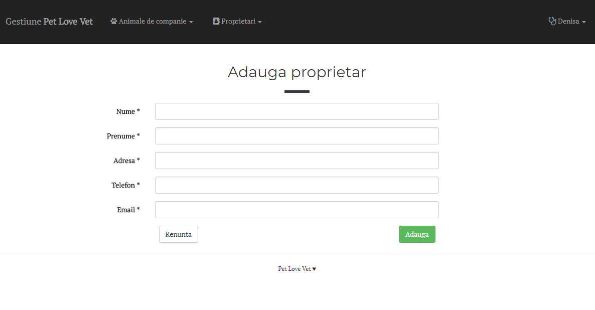

# vet-practise
	This is a website for a veterinary practise (in Romanian) - for web dev course.
    It is built using HTML, CSS, Bootstrap 3, JavaScript, PHP, MySQL, XAMPP.
    
	It includes a section for data management. 
    After the vet is logged in, he can list, search, add, edit, and delete his pacients and owners from the database.
    TODO:
        - add other tables with prescriptions, treatments etc;
        - add table pagination;
        - add more styling and interactivity;
        
    Here you can see some screenshots of the admin part
    
    
    
    